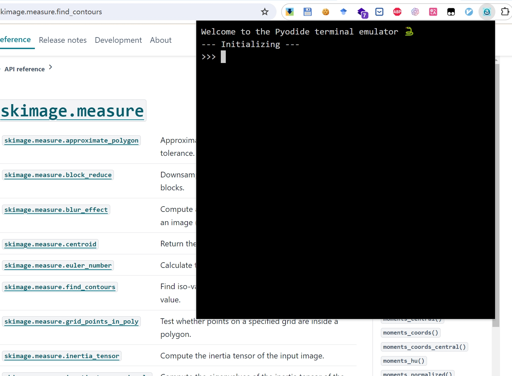

# chrome-python-console

A chrome extension that allows you to run python code in the browser.

## Installation

### from zip file

1. Download the zip file from the [latest release](https://github.com/Nanguage/chrome-python/releases)
2. Unzip the file
3. Open chrome://extensions
4. Enable developer mode
5. Click "Load unpacked"
6. Select the unzipped folder

